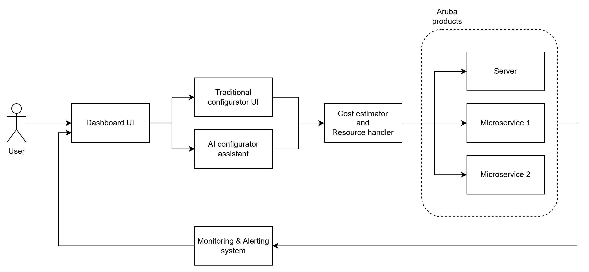

# Airu: Your Cloud Budget Assistant 🌥️💰  

**Airu** is your companion for managing cloud budgets effectively, from simple forms to advanced, agentic AI-powered chat capabilities. It empowers users to track, optimize, and predict cloud spending with ease. Whether you're a cloud engineer, a financial analyst, or a business owner, Airu ensures your cloud budgets are managed proactively and efficiently.

## 🚀 Features

- **Budget Tracking:** Simple forms for tracking cloud budgets across multiple services.
- **Optimization Suggestions:** Cost-saving recommendations tailored to your usage patterns.
- **Agentic AI Chat:** Conversational assistant to answer your budget-related queries and provide actionable insights.


## 🏗️ Architecture

Airu is designed to be robust, scalable, and user-friendly. Here's a high-level overview of its architecture.



1. **Frontend:**
   - Built with **JavaScript**, **React**, and **Next.js** for a dynamic and SEO-friendly user interface.
   - Components for forms, dashboards, and chat interfaces.
2. **Backend:**
   - Built with **Python** and **FastAPI** for high-performance API development.
   - Microservices for modularity, handling forecasting, optimization, and reporting separately.
3. **AI Engine:**
   - Powered by **Cheshire Cat**, an agnostic framework for building intelligent agents.
   - Integrated with **Groq** for faster and more efficient text generation.
4. **Database:**
   - **PostgreSQL** for structured relational data.
   - **MongoDB** for unstructured and semi-structured data.

For more information please see the following [slides](https://docs.google.com/presentation/d/1WDoEECRgfSmiZ-muWDkCUB-ktjgDrWiHVUI1OPj3XUE/edit?usp=sharing).


## 🛠️ Installation from zero

Follow these steps to get started with Airu

1. **Clone the Repository:**
   ```bash
   git clone https://github.com/Gabbosaur/Airu.git
   cd airu
   ```
2. **Make sure you have Docker installed**
3. **Run the following command**
   ```
   docker compose up
   ```
4. **Set up the preferred LLM provider on Cheshire Cat**
- Have an OpenAI/Gemini/Cohere/Groq/etc API key ready
- Navigate to Cheshire Cat Admin page
   ```
   localhost:1865
   ```
- Login with admin/admin
- Navigate to Settings page
- Configure LLM provider, choose the preferred one
- Configure Embedder model, I suggest nomic-ai/nomic-embed-text-v1.5
- Save the setting


4. **Navigate to the Airu's main page**
   ```
   localhost:3000
   ```

## 🖋️ Authors
- Gabriele Guo
- Chenghao Xia
- Valerio Jiang